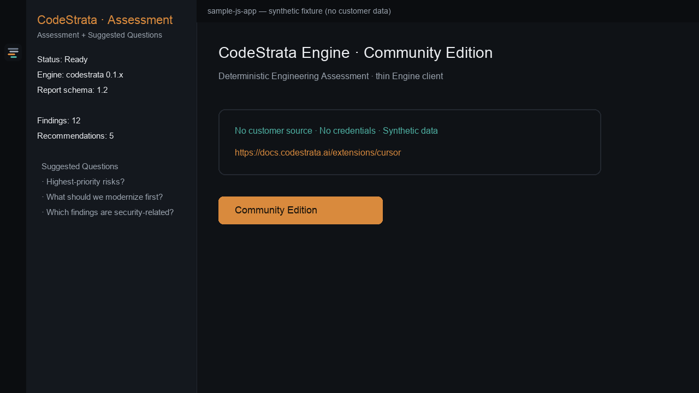
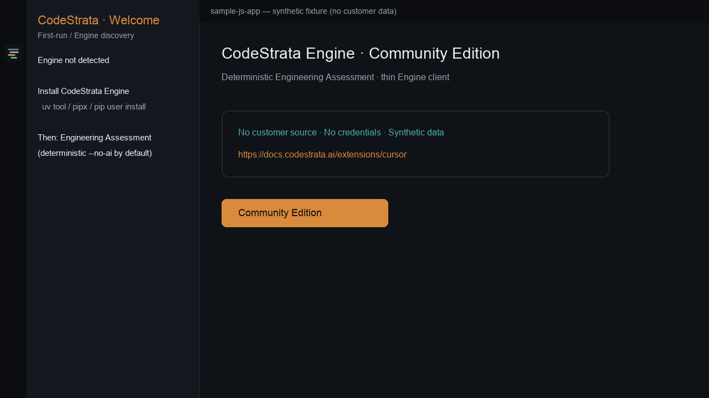
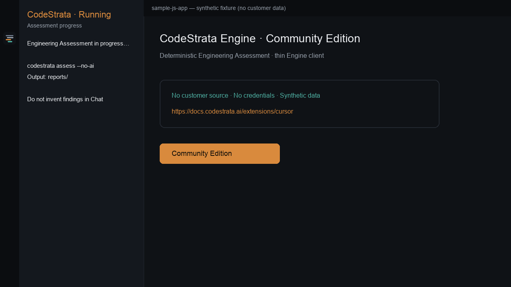
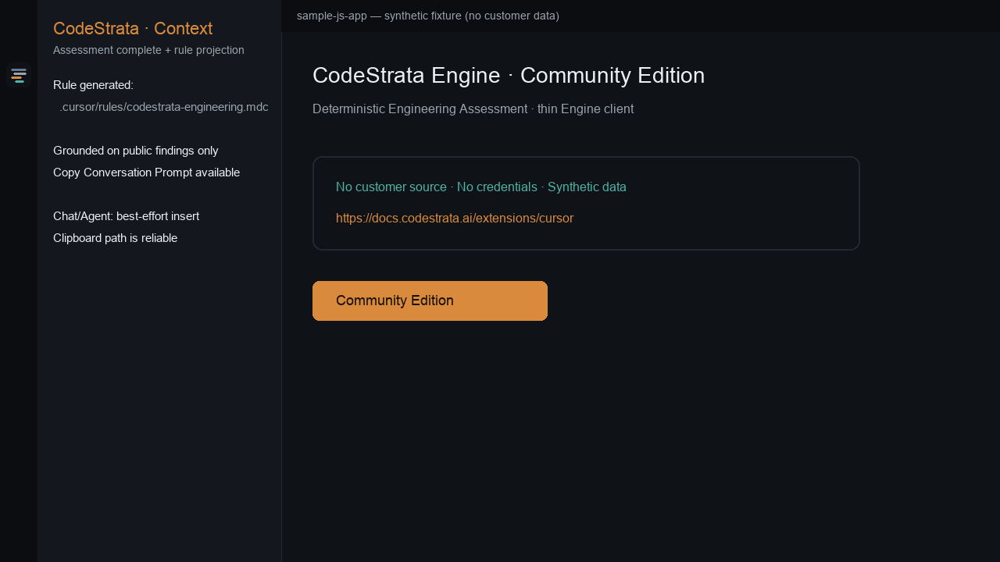
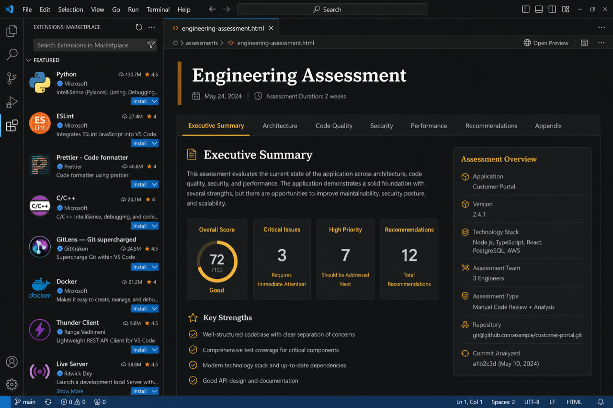

# CodeStrata Cursor Extension (Community Edition)

**Engineering Intelligence for Modern Software Organizations** — bring deterministic
**CodeStrata Engine** Engineering Assessments into **Cursor** Chat / Agent.

**Identifier:** `codestrata.codestrata-cursor` · **Version:** 0.2.0  
**Requires:** CodeStrata Engine `>=0.1.0 <2.0.0` · Report schema **1.2**

```text
CodeStrata Cursor Extension
        ↓
CodeStrata Engine CLI
        ↓
Public assessment artifacts
        ↓
.cursor/rules/codestrata-engineering.mdc
        ↓
Cursor Chat / Agent
```

This extension is a **thin client**. It does **not** independently analyze source code.
**CodeStrata Engine** performs the assessment. The extension consumes **public** report
artifacts and projects them into a generated Cursor rule.

**Docs:** [https://docs.codestrata.ai/extensions/cursor](https://docs.codestrata.ai/extensions/cursor)  
**Support:** [SUPPORT.md](SUPPORT.md) · **Privacy:** [PRIVACY.md](PRIVACY.md) · **Security:** [SECURITY.md](SECURITY.md)



### Marketplace screenshots

| | |
| --- | --- |
| Welcome / Engine |  |
| Running |  |
| Complete + rule |  |
| Activity |  |
| Findings |  |
| Recommendations |  |
| HTML report |  |

## Who it is for

Cursor users who want **grounded** Chat/Agent context from local Engineering
Assessments. Community Edition only — not CodeStrata Platform.

## Prerequisites

- Cursor (VS Code API `^1.85.0` compatible)
- Python 3.12+
- CodeStrata Engine (`codestrata`)

See [COMPATIBILITY.md](COMPATIBILITY.md).

## Install

1. Install **CodeStrata Cursor Extension** from Open VSX / Marketplace (or VSIX).
2. Open a **trusted** repository folder.
3. On first run, detect/install Engine, then run an Engineering Assessment.

```bash
python -m pip install --user 'codestrata[mcp]'
codestrata version
```

## First command

```text
CodeStrata: Engineering Assessment
```

## First journey

1. Install extension → open repository.
2. Verify or **Install CodeStrata Engine**.
3. **CodeStrata: Engineering Assessment** (deterministic / `--no-ai` by default).
4. Confirm `.cursor/rules/codestrata-engineering.mdc` is generated.
5. Open Cursor Chat or Agent.
6. Use a **Suggested Question** or **Copy Conversation Prompt**.
7. Ask: *What are the highest-priority engineering risks in this repository?*
8. Open the HTML report; refresh when the repo changes.

Cursor answers may still include model inference. CodeStrata findings must **not**
be invented. Inspect source before applying changes.

## Generated Cursor rule

Path: `.cursor/rules/codestrata-engineering.mdc`

| Event | Behavior |
| ----- | -------- |
| Assessment success / Refresh | Create or atomically replace CodeStrata-managed rule |
| Clear Assessment | Remove only the CodeStrata-managed file |
| User rules | Sibling `.cursor/rules/*` files are preserved |

**Recommended:** treat the file as a local generated artifact (`.gitignore`) unless
you intentionally share assessment snapshots.

## Commands

| Command | Purpose |
| ------- | ------- |
| Engineering Assessment | Deterministic assess |
| Engineering Assessment with AI | Optional Engine AI |
| Refresh / Clear Assessment | Reload or remove context + managed rule |
| Install CodeStrata Engine | Guided install |
| Check CodeStrata Environment | Discovery + doctor |
| Show Welcome / First Run | Replay onboarding |
| Open Report | `report.html` |
| Show Findings / Recommendations | From public artifacts |
| Copy Conversation Prompt | Clipboard grounded prompt |
| Open Documentation / Output | Docs + logs |

## Settings

Reuse Engine `codestrata.toml`. Extension settings only pass CLI flags
(`codestrata.engine.executable`, output directory, config path, default `--no-ai`).

## Optional AI

Engine providers only (Bedrock / OpenAI / Azure OpenAI / Anthropic).  
Credentials never stored in extension settings. Not Platform keys.

## Compatibility

| Contract | Support |
| -------- | ------- |
| Cursor / VS Code API | `^1.85.0` |
| CodeStrata Engine | `>=0.1.0 <2.0.0` |
| Report schema | `1.2` |
| Edition | Community Edition |

## Privacy & security

See [PRIVACY.md](PRIVACY.md) and [SECURITY.md](SECURITY.md).  
No Platform APIs · no extension telemetry · secrets redacted · shell disabled.

CodeStrata does **not** govern Cursor’s own privacy/model controls.

## Community vs Platform

Local Engine · local assessments · optional AI.  
**Not included:** Platform, Portfolio Intelligence, Executive Intelligence, Repository Retrieval.

## Troubleshooting

| Symptom | Action |
| ------- | ------ |
| Engine not found | Install Engine / configure executable |
| Suggested prompts disabled | Run Engineering Assessment |
| Stale Chat answers | Refresh Assessment |
| Chat not opened automatically | Paste copied prompt |
| Untrusted workspace | Manage Workspace Trust |

## Known limitations

- Automated tests use VS Code Extension Host (Cursor-compatible APIs), not the Cursor IDE binary.
- Cursor Chat command IDs vary; clipboard copy is the reliable transfer path.
- Live Chat grounding must be validated manually ([RELEASE_CHECKLIST.md](RELEASE_CHECKLIST.md)).

## Development

```bash
npm install
npm test
npm run package
```

See [CONTRIBUTING.md](CONTRIBUTING.md) and [EXTRACTION.md](EXTRACTION.md).

## License

MIT — see [LICENSE](LICENSE).
