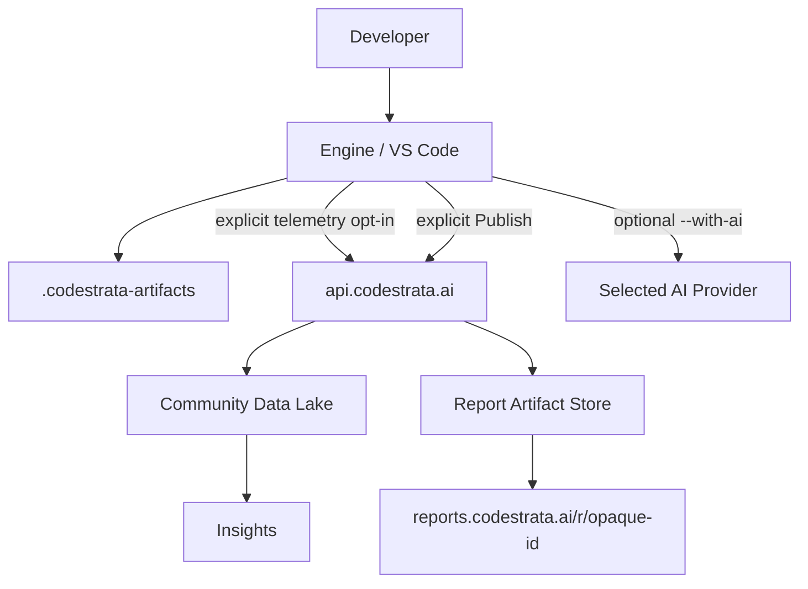

# Community Cloud Architecture

Canonical public architecture for **CodeStrata Community Edition v0.2.0**.

This page is for a CTO / VP Engineering who needs to understand services,
boundaries, authentication, storage, and failure isolation — without conflating
telemetry, AI enrichment, and report publishing.

Authority: Slice 18.1 inventories, Epic 17 production verification, OpenTofu
modules, and the live Community API route registry. Runtime/infrastructure win
over prose.

Related:

- [Data Lake](/architecture/data-lake)
- [Insights](/architecture/insights)
- [Community Cloud API](/reference/community-api/)
- [Source Locality](/security/source-locality)
- [Telemetry](/reference/telemetry)
- [Data Collection](/security/data-collection)
- [Privacy](/security/privacy)
- [Retention and Deletion](/security/retention-and-deletion)
- [AI Providers](/ai-providers/)

## Production path (conceptual)

```text
CLI / VS Code / Engine
  → https://api.codestrata.ai   (public Community API authority)
  → API Gateway (TLS custom domain)
  → Community Cloud Lambda
  → auth / schema / privacy validation
  → Data Lake  |  Report Artifact Store  |  Insights APIs (as applicable)
```

Do **not** treat the raw AWS `execute-api` hostname as the public product
contract. It may exist as an implementation/fallback endpoint behind the custom
domain; **`https://api.codestrata.ai` is the only public Community API
authority.**

## Complete Community data-flow diagram

Three outbound paths are intentionally distinct:



| Path | Trigger | Destination |
| --- | --- | --- |
| Local assessment | `assess` | `.codestrata-artifacts/` only |
| Telemetry | Explicit opt-in + Community credential | Data Lake → Insights |
| AI enrichment | `--with-ai` | Provider endpoints (**not** Community telemetry) |
| Report publish | Explicit Publish/Share | Report Artifact Store → opaque public URL |

## API domain

| Topic | Value |
| --- | --- |
| Public authority | `https://api.codestrata.ai` |
| Role | TLS-terminated custom domain for Community Cloud HTTP API |
| Not public authority | Raw `execute-api` hostname |

## Community API route groups

Derived from the runtime route inventory (16 routes). Details and examples:
[Community Cloud API](/reference/community-api/).

### A. Public Community

| Method | Path | Auth | Purpose |
| --- | --- | --- | --- |
| `GET` | `/api/v1/health` | None | Liveness / version probe |
| `GET` | `/api/v1/community/status` | None | Public Community metadata (GitHub-backed) |
| `GET` | `/api/v1/reports/{public_id}` | None | Public read of an **explicitly published** opaque report |

### B. Authenticated ingestion (Community client credential + consent)

| Method | Path | Destination | Current producer honesty |
| --- | --- | --- | --- |
| `POST` | `/api/v1/telemetry` | Data Lake `raw/` | **ACTIVE** after opt-in + credential |
| `POST` | `/api/v1/assessment-metadata` | Data Lake `raw/` | **NOT_EMITTED_BY_CURRENT_ASSESS_PATH** |
| `POST` | `/api/v1/cli-events` | Data Lake `raw/` | **NOT_EMITTED_BY_CURRENT_ASSESS_PATH** |
| `POST` | `/api/v1/extension-events` | Data Lake `raw/` | **CONTRACT_ONLY** |
| `POST` | `/api/v1/ai-usage` | Data Lake `raw/` | **DEFERRED** on assess path |

Ingestion failure does **not** fail local assessment.

### C. Report publishing (authenticated)

| Method | Path | Purpose |
| --- | --- | --- |
| `POST` | `/api/v1/reports/upload-intents` | Create upload intent |
| `POST` | `/api/v1/reports` | Finalize / publish |
| `DELETE` | `/api/v1/reports/{public_id}` | Authenticated revoke |

Storage: **Report Artifact Store** (not the Data Lake).

### D. Public report read

Covered under Public Community (`GET /api/v1/reports/{public_id}`), also delivered
via `https://reports.codestrata.ai/r/<opaque-id>`.

### E. Community Status

`GET /api/v1/community/status` — public. Engine version prefers the latest
**published** GitHub Release for `CodeStrata/codestrata-engine`, with candidate
package fallback when no published release is available. Star counts are live
GitHub metadata — not contractual constants. Fail-soft when GitHub is unavailable.

**Version semantics (do not conflate):**

| Surface | Meaning |
| --- | --- |
| Installed CLI (`codestrata --version`) | Package/runtime version of the local install (e.g. candidate `0.2.0`) |
| Community Status `engine_version` | Latest **published** GitHub Release (may remain `0.1.0` until Release Readiness publishes `v0.2.0`) |

Website Community Edition version display is intentionally bound to Community
Status — so pre-release sites may show `0.1.0` until the GitHub Release exists.

### F. Private Insights

| Method | Path | Notes |
| --- | --- | --- |
| `POST` | `/api/v1/insights/auth/login` | Operator login |
| `POST` | `/api/v1/insights/auth/logout` | Logout |
| `GET` | `/api/v1/insights/auth/session` | Session status |
| `GET` | `/api/v1/insights/api/overview` | Aggregates |
| `GET` | `/api/v1/insights/api/published-reports` | Published report **metadata** index (current/previous) |
| `GET` | `/api/v1/insights/api/validation-reports` | Temporary private **validation corpus** (paginated) |

These are **not** public Community API surfaces. They require Insights
operator authentication (same-origin / session). See [Insights](/architecture/insights).

## Telemetry ingestion flow (active)

```text
Engine
  → explicit opt-in
  → authenticated POST /api/v1/telemetry
  → schema / privacy validation
  → accepted event
  → Community Data Lake (raw/)
  → Insights aggregates (bounded reader)
```

Invalid / privacy-invalid requests may be **rejected before persistence**.
Quarantine is a storage class for quarantine objects when written — not a claim
that every HTTP reject is archived.

## Authentication boundaries

| Surface | Auth |
| --- | --- |
| Health, Community Status, published report GET | Public |
| Ingestion + publish / revoke | Community client credentials (fingerprint-verified) |
| Insights auth + aggregate APIs | Insights operator session / password verifier |

Credential values and secret identifiers are **not** published in docs.

## Report Artifact Store (separate from Data Lake)

```text
Local report
  → explicit Publish
  → api.codestrata.ai
  → private Report Artifact Store
  → https://reports.codestrata.ai/r/<opaque-id>
```

Product-visible retention: **current + previous** (application-enforced).
S3 object versioning (when enabled) is operational recovery — not product
history. See [Retention and Deletion](/security/retention-and-deletion).

## Reports domain

| URL | Behavior |
| --- | --- |
| `https://reports.codestrata.ai/` | Branded landing only |
| `https://reports.codestrata.ai/r/<opaque-id>` | Public published report |
| Directory / search / repo enumeration | **None** |
| Unknown or revoked id | **404** |

### Temporary private validation registry

During Community growth, successfully published reports that pass independent
public GET verification are also recorded in a **private** validation registry
inside the Report Artifact Store (`metadata/validation/entries/`).

| Property | Rule |
| --- | --- |
| Public exposure | **None** — Insights operator auth only |
| `reports.codestrata.ai` listing | **None** — opaque links unchanged |
| Local manifest | `.codestrata-artifacts/.../public-report-urls.json` is a **release-run export/snapshot**, not the sole durable copy |
| Product positioning | Temporary internal validation tooling — not a permanent Community capability |
| Removal | Can be removed/replaced by commercial portfolio management without changing `https://reports.codestrata.ai/r/<id>` |

## Docs architecture

`https://docs.codestrata.ai` is the public transparency / reference surface.

| Surface | Role |
| --- | --- |
| Docs | Architecture + policy documentation |
| Community API | Machine/product HTTP contracts |
| Insights | Authenticated operator dashboard |
| Reports | Opaque public published reports |

## Failure isolation

| Component unavailable | Local assessment |
| --- | --- |
| Telemetry / ingestion | Continues; no transmission |
| AI provider | Continues deterministic reports (fail-soft) |
| Report publishing | Local report unchanged |
| Insights | Ingestion / local assess unaffected |
| GitHub (Community Status) | Fail-soft degraded / cached / candidate fallback |

## Production availability (v0.2.0)

Live production posture:

- `api.codestrata.ai`
- `reports.codestrata.ai`
- `docs.codestrata.ai`
- `insights.codestrata.ai`
- Production ingestion enabled when clients opt in with credentials

VS Code Marketplace publication is a separate Release Readiness concern — do not
infer Marketplace-live from Community Cloud liveness.

## Security posture (public level)

- TLS on public Community domains
- Private encrypted Data Lake and Report Artifact Store
- Bounded IAM: ingestion writer vs Insights reader separation
- Secrets Manager for operational credentials / verifiers
- Auth-gated ingestion and publish/revoke
- Infrastructure workflows use OIDC-style cloud auth patterns (no static GitHub
  AWS keys as the intended production pattern)

No account IDs, ARNs, or secret values are required for this transparency page.

## Cost / scale posture

v0.2.0 intentionally uses lightweight serverless components (API Gateway +
Lambda + private object storage). This page does not publish internal cost
figures.

## Writer / reader IAM boundary (conceptual)

| Role | Intent |
| --- | --- |
| Community ingestion writer | Bounded write into lake prefixes / report store as designed |
| Insights reader | Bounded read of lake `raw/` for aggregates |
| Neither | Assumed blanket delete/admin over product stores |

See [Data Lake](/architecture/data-lake) and [Insights](/architecture/insights).
