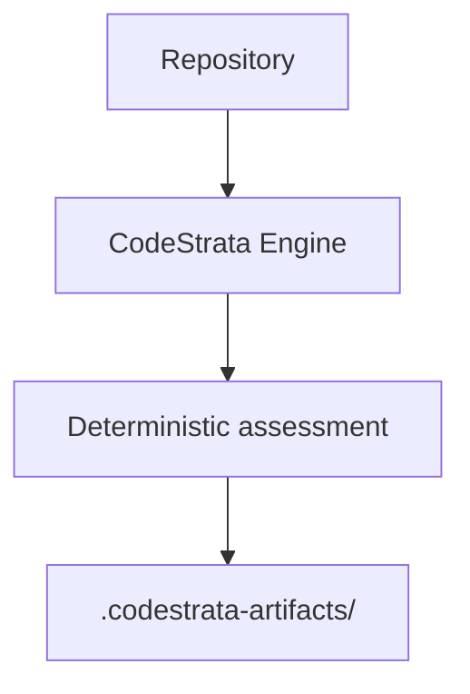
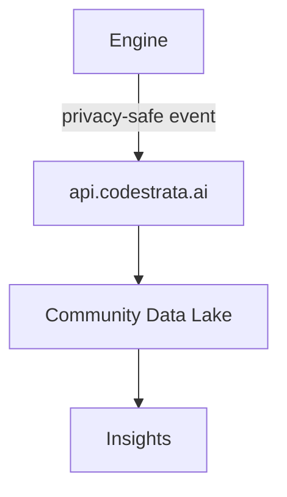
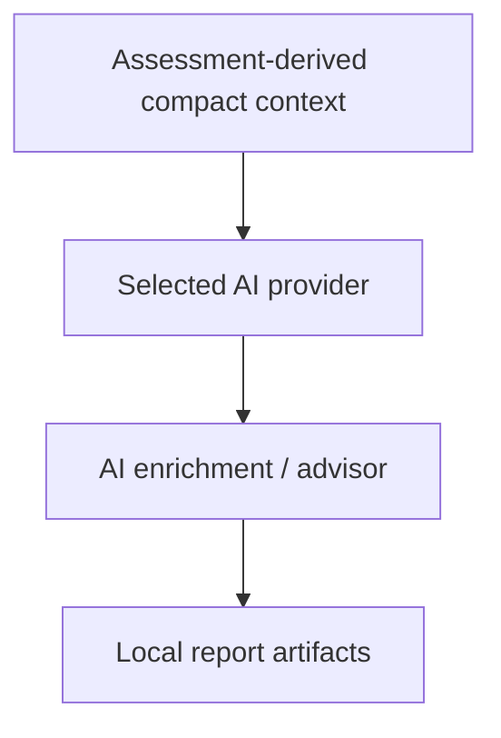
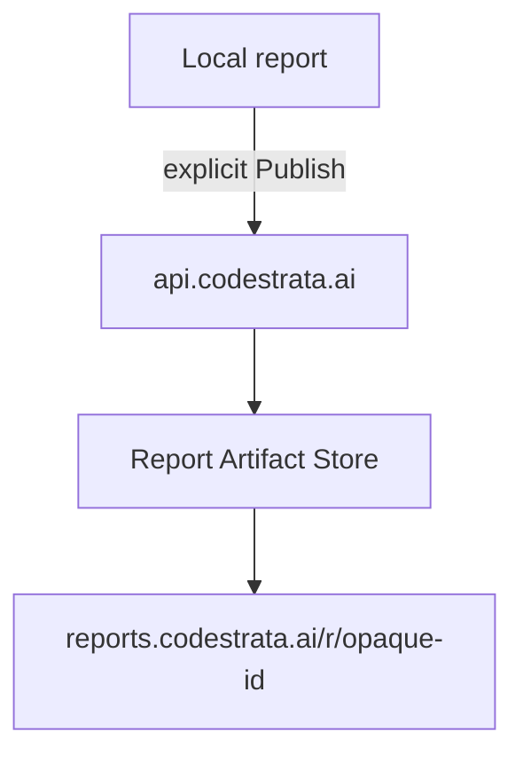

# Source Locality

Canonical answer to:

**What exactly stays on my machine, and what leaves it when I use CodeStrata?**

This page separates five independent workflows. Do **not** collapse them into
one claim such as “nothing leaves your machine” — that phrase is only true for
specific modes (for example deterministic `--no-ai` assessment **with**
telemetry off **and** no publish **and** no AI enrichment).

Authority: Slice 18.1 source-locality / AI / never-collected registers and
Community Engine runtime.

Related:

- [AI Providers](/ai-providers/) — optional enrichment data flow
- [Telemetry](/reference/telemetry) — consent and transport
- [Data Collection](/security/data-collection) — Community ingest fields
- [Privacy](/security/privacy)
- [Retention and Deletion](/security/retention-and-deletion)

## Source-locality matrix

| Workflow | Triggered by | Data leaving machine | Destination | Source code? | Report body? | Credential required? | Failure blocks assessment? |
| --- | --- | --- | --- | --- | --- | --- | --- |
| Deterministic Assessment | `codestrata assess` (default `--no-ai`) | None for assessment/source processing | Local `.codestrata-artifacts/` | Processed locally only | Written locally only | No AI / Community credential required for local assess | n/a (local) |
| Telemetry | Explicit opt-in + Community credential | Privacy-safe product events | `api.codestrata.ai` → Community Data Lake → Insights | **No** | **No** | Community client credential for HTTP | **No** |
| AI enrichment | Explicit `--with-ai` + configured provider | Bounded assessment-derived enrichment context / prompts | Chosen provider (Bedrock / OpenAI / OpenRouter) — **not** CodeStrata telemetry | **No full tree**; bounded evidence path/excerpt clips may be included | **No** full HTML/JSON report body | Provider credentials | **No** (fail-soft) |
| Report publishing | Explicit Publish/Share confirm | Selected Assessment/EIR package | Report Artifact Store → `reports.codestrata.ai/r/<id>` | Not as a checkout; published report artifacts only | **Yes** (selected published package) | Packaged public Community client (or env override) | n/a (separate command) |
| Insights | Authenticated operator session | Reads already-ingested lake aggregates (no new customer source upload from Insights UI) | Insights private API / SPA | **No** | **No** | Insights operator auth | n/a |

## Deterministic Assessment

```text
Repository
  → CodeStrata Engine
  → local deterministic assessment
  → .codestrata-artifacts/assessments/<repository-id>/{current,previous}/
```

| Topic | Behavior |
| --- | --- |
| Default | `--no-ai` (deterministic only) |
| AI required? | **No** |
| Provider credentials required? | **No** |
| Provider network calls required? | **No** |
| Local reports | Remain fully functional without AI |
| Telemetry | Separate decision (`--telemetry-allow` / deny / default off) |
| Report publishing | Separate decision (`report publish --confirm-public-publish`) |

**Phrase carefully:** for assessment/source processing with `--no-ai`, CodeStrata
does not call AI providers and does not need provider credentials. That does
**not** mean absolutely zero network traffic can never occur if you separately
enable telemetry, publish, or other explicitly configured network services.

| Question | Answer |
| --- | --- |
| What stays local? | `assessment.json`, `assessment.html`, `heads/*.json`, and related local products |
| What can leave? | Nothing for this workflow alone; optional later telemetry metadata or explicit publish |
| Source code involved outbound? | No outbound for this workflow |
| Report content outbound? | No (unless you later publish) |

## Telemetry

```text
Engine
  → privacy-safe event (after explicit opt-in + credential)
  → https://api.codestrata.ai
  → Community Data Lake
  → Insights aggregates
```

| Question | Answer |
| --- | --- |
| What stays local by default? | All product telemetry (disabled by default) |
| What can leave? | Privacy-safe events only (see [Data Collection](/security/data-collection)) |
| Trigger | Explicit allow / interactive Yes + Community credential |
| Source code? | **Not** collected by Community telemetry |
| Report body? | **Not** telemetry |
| Failure blocks assessment? | **No** |

## AI enrichment

```text
Assessment-derived compact context
  → selected AI provider (direct)
  → AI enrichment / advisor narrative
  → local report artifacts (deterministic foundation unchanged)
```

| Question | Answer |
| --- | --- |
| What stays local? | Deterministic findings/evidence; provider keys not stored in artifacts |
| What leaves? | Provider-specific enrichment prompts + bounded assessment-derived context |
| Trigger | `--with-ai` + configured provider/credentials |
| Consent | Provider configuration — **distinct** from telemetry consent |
| Destination | Bedrock / OpenAI / OpenRouter endpoints — **not** `api.codestrata.ai` as an AI proxy |
| Source code? | Full repository checkout / source tree **not** uploaded; bounded evidence **path or excerpt clips** may be included in the enrichment context |
| Report body? | Full HTML/JSON report bodies are **not** the provider wire payload |
| Failure blocks assessment? | **No** — fail-soft; deterministic reports still write |

Exact payload classes: [AI Providers](/ai-providers/#what-ai-enrichment-sends).

## Report publishing

```text
Local report
  → explicit Publish/Share
  → https://api.codestrata.ai (publish APIs)
  → private Report Artifact Store
  → https://reports.codestrata.ai/r/<opaque-id>
```

| Question | Answer |
| --- | --- |
| What stays local? | Local report always generated regardless of publish |
| What leaves? | Selected Assessment/EIR package on explicit confirm |
| Trigger | `codestrata report publish` (interactive) or `--confirm-public-publish` (CI); VS Code Publish/Share |
| Authorization | Explicit publish confirmation (and private/local acknowledgement when needed). Telemetry consent is separate and not required for publish. |
| Source code? | Not as a checkout; published report artifacts only |
| Report body? | **Yes** — selected published package |
| Failure | Does not rewrite local authoritative artifacts |
| Community auth | Packaged public Community client credential (Bearer); no AWS account required |

## Insights

| Question | Answer |
| --- | --- |
| What stays local? | n/a (operator dashboard) |
| What leaves / is read? | Already-ingested Data Lake aggregates; Insights UI does not upload customer source |
| Trigger | Authenticated operator session |
| Consent | Insights password/session — **not** end-user telemetry consent |
| Source / report bodies? | No customer source upload; no report HTML/JSON bodies as lake telemetry |

## Three independent outbound paths

Do not conflate these:

| Path | Leaves machine as | Destination |
| --- | --- | --- |
| AI enrichment | Assessment-derived enrichment context | Chosen third-party / AWS Bedrock provider |
| Telemetry | Privacy-safe product events | CodeStrata Community Cloud (`api.codestrata.ai`) → Data Lake |
| Report publishing | Explicit detailed report package | Report Artifact Store → opaque public URL |

Architecture detail:
[Community Cloud](/architecture/community-cloud) ·
[Data Lake](/architecture/data-lake) ·
[Insights](/architecture/insights).

Community API `ai_usage` is a **usage-metadata** ingest contract for Community
Cloud — **not** a proxy that forwards prompts to OpenAI/Bedrock/OpenRouter.
Assess-path `ai_usage` emission remains **deferred / construction-only** in
v0.2.0.

## Data-flow diagrams

### A. Default local assessment



### B. Telemetry opt-in



### C. AI enrichment



### D. Report publish



Source code does **not** follow every arrow. Only the AI enrichment path may
include bounded evidence path/excerpt clips as part of compact context.
