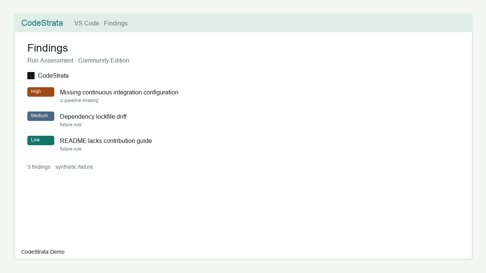
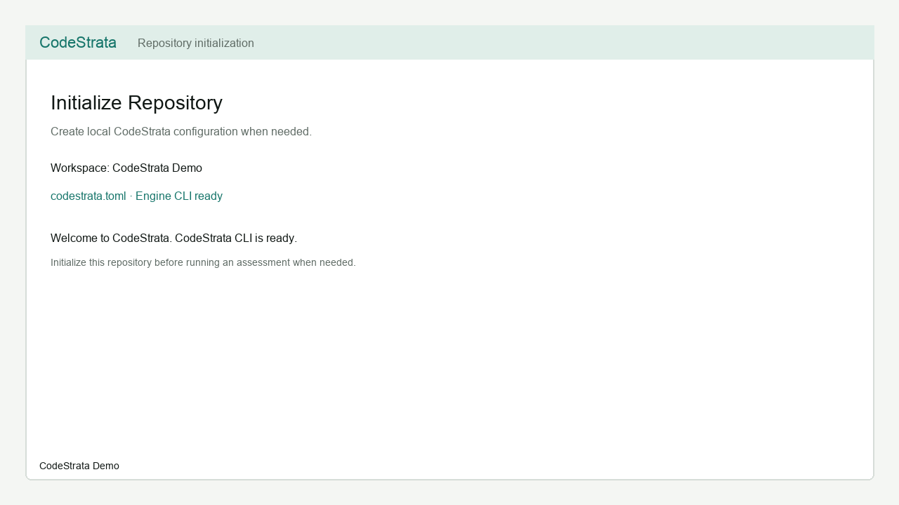
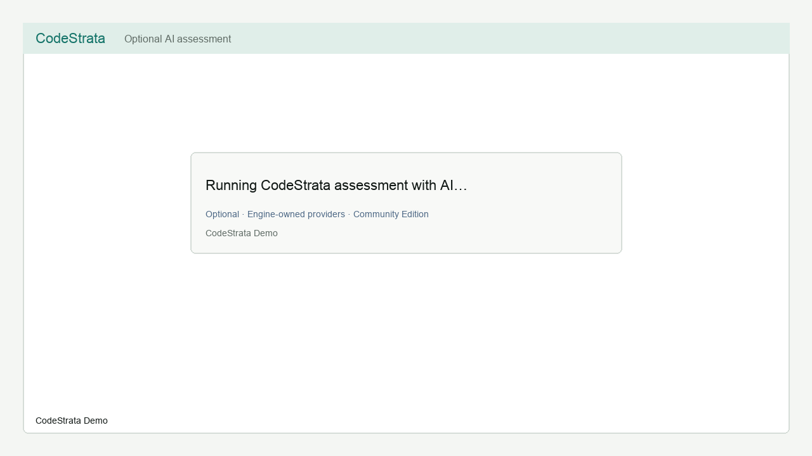

# CodeStrata – Engineering Intelligence

**Engineering decisions grounded in code.**

Run local Engineering Assessments with **CodeStrata Engine** from VS Code
(Community Edition). Assess one repository at a time, review findings and
recommendations, and open a generated Engineering Intelligence HTML report—
without leaving the editor.

**Version:** 0.2.0 · **Requires:** VS Code `^1.85.0` and CodeStrata Engine CLI
`0.2.x`

## What CodeStrata Does

CodeStrata turns repository evidence into findings you can inspect, rerun, and
challenge. The VS Code extension is a thin client: it discovers a local Engine
CLI, runs assessments you start, and surfaces results in the editor.

It does **not** replace organizational Platform products, and it does **not**
connect to CodeStrata Platform APIs.

## What You Get

- Local repository assessment through CodeStrata Engine
- Findings and recommendations in the CodeStrata activity views
- An Engineering Intelligence HTML report generated by the Engine
- Optional AI-assisted assessment enrichment (Engine-owned providers)

Screenshots below use synthetic fixture content.

| | |
| --- | --- |
| Assessment |  |
| Assessment report |  |
| Progress |  |
| Initialization |  |
| Optional AI |  |

## Requirements

- **VS Code** `^1.85.0` (this Community extension supports VS Code only)
- **CodeStrata Engine CLI** `0.2.x` installed and discoverable
- A **folder workspace** with a CodeStrata configuration before assessment
  (`codestrata.toml`, created by Initialize Repository when missing)

The extension does **not** install the CLI automatically, download binaries, or
modify your `PATH` or shell profile.

## Quick Start

1. Install the CodeStrata Engine CLI using the [installation guidance](docs/cli-installation.md)
   (guidance-only from the extension; see also public Engine docs).
2. Open your repository folder in VS Code.
3. Run **CodeStrata: Initialize Repository** (creates or preserves Engine config).
4. Run **CodeStrata: Run Assessment**.
5. When prompted after success, open the HTML report—or use
   **CodeStrata: Open HTML Report** (or choose **Open Report** when the assessment completes).
6. Optionally run **CodeStrata: Run Assessment with AI** if Engine AI providers
   are configured.

## CLI Installation

Use **CodeStrata: Install CodeStrata Engine** for guided steps (copy a command,
open a terminal, or open docs). The extension:

- Can **detect** a compatible CLI
- Can **guide** installation
- Does **not** run package managers for you
- Does **not** download Engine binaries
- Does **not** change `PATH` or shell profiles

Set `codestrata.engine.executable` only when you need an explicit absolute path.

## Repository Initialization

**CodeStrata: Initialize Repository** asks the Engine to create local
configuration (`codestrata.toml`) when needed. Initialization is:

- Explicit and user-triggered
- Engine-owned (the extension does not write the config file itself)
- Safe for existing valid configuration (no force overwrite)

Assessment requires a ready repository configuration first.

## Running an Assessment

**CodeStrata: Run Assessment** runs a deterministic Engineering Assessment
through the local Engine CLI:

1. Workspace and repository readiness
2. Compatible CLI discovery
3. Optional command-local telemetry prompt (eligible assessments only; default
   **Deny**)
4. Local Engine process with progress indication
5. Local report artifacts (including HTML when generated)

Results appear in Findings / Recommendations and Problems diagnostics.

## Assessment with AI

**CodeStrata: Run Assessment with AI** is optional and explicitly selected.

The VS Code extension does not directly send repository source to AI providers.
When AI assessment is enabled, the local CodeStrata Engine may send provider request content to the AI provider you configure.

- Provider credentials and configuration belong to the Engine (`codestrata.toml`
  / environment)—not extension settings
- The extension does not select providers automatically or store API keys

## Progress

Assessment progress is **indeterminate** (status text without a fabricated
percentage). You can cancel an in-progress assessment from the progress UI when
shown. Progress does not invent per-file or per-finding completion.

## Reports

The Engine generates local report artifacts. After a successful assessment you
can open the HTML report:

- **Open HTML Report** opens an existing local `report.html`
- Paths are validated before opening
- A missing or failed report open does **not** change the assessment result

## Failure and Recovery

When something fails, the extension explains what happened and suggests
user-triggered next steps, for example:

- Install or correct the Engine CLI
- Initialize the repository
- Rerun the assessment
- Open an existing report
- Review installation guidance

Nothing installs, retries, or remediates automatically.

## CLI Compatibility

| Extension | Supported Engine CLI |
| --------- | -------------------- |
| 0.2.0 | `0.2.x` (release builds; no prerelease) |

- Older CLI lines (for example `0.1.x`) → install a supported `0.2.x` CLI
- Newer unsupported minors on major `0` → install a supported `0.2.x` CLI
- Major `1.x` and above → unsupported until defined
- Missing or invalid version → resolve CLI installation first

Use **CodeStrata: CodeStrata Doctor** to check environment readiness.

## Privacy and Source Locality

- Standard assessment runs through the **local** Engine CLI
- This extension does **not** upload repository source to CodeStrata Community
  services
- Reports and findings remain **local** unless you share them yourself
- Telemetry is **optional**, prompted only for eligible assessment commands,
  defaults to **Deny**, and is **not saved**
- Production telemetry collection is **not operational** in this release
  (transport unavailable; no HTTP endpoint)
- Analytics construction is local-only with an unavailable sink (not operational
  production collection)
- No installation identity or machine identity is used for telemetry

AI assessment is qualified separately above: Engine-owned provider flow may use
an external provider when you configure one.

## Telemetry

For **Run Assessment** and **Run Assessment with AI** only:

- Prompt is command-local (that run only)
- Default answer is **Deny**
- Consent is not persisted across commands or sessions
- No machine ID / installation ID
- No production transmission in v0.2.0

Init, install guidance, report open, and recovery actions do not prompt for
telemetry.

## Security

See [SECURITY.md](SECURITY.md) and [PRIVACY.md](PRIVACY.md).

- Extension does not upload source to Community services
- Local CLI boundary for assessment
- No stored telemetry consent
- AI provider credentials are not stored in extension settings

## Known Limitations

- CLI auto-install is not supported (guidance only)
- Extension 0.2.0 requires Engine CLI `0.2.x`
- Progress is indeterminate (no percentage completion)
- Optional AI depends on Engine provider configuration
- Production telemetry and analytics collection are not operational
- Marketplace publication remains a separate human-approved release gate

## Commands

| Command | Purpose |
| ------- | ------- |
| Initialize Repository | Engine-owned local configuration |
| Run Assessment | Deterministic local assessment |
| Run Assessment with AI | Optional Engine AI enrichment |
| Open HTML Report | Open local `report.html` |
| Install CodeStrata Engine | Guidance-only install help |
| CodeStrata Doctor | Environment / CLI readiness check |
| Show Welcome / First Run | Replay onboarding |
| Refresh Findings / Recommendations | Reload artifacts |
| Clear CodeStrata Results | Clear trees and diagnostics |
| Open CodeStrata Output | Output channel |
| Open Documentation | Product documentation |

## Settings

| Setting | Purpose |
| ------- | ------- |
| `codestrata.engine.executable` | Explicit CLI path (optional) |
| `codestrata.assessment.outputDirectory` | Assessment output directory |
| `codestrata.assessment.configPath` | Optional path to `codestrata.toml` |
| `codestrata.assessment.defaultNoAi` | Deterministic default for Run Assessment |
| `codestrata.assessment.extraArgs` | Advanced CLI passthrough |
| `codestrata.findings.groupBy` | Findings tree grouping |
| `codestrata.ai.providerHint` | UX hint only (not credentials) |

## Community vs Platform

| This extension (Community) | CodeStrata Platform |
| -------------------------- | ------------------- |
| Local Engine assessment and reports | Organizational multi-repo products |
| Optional Engine AI providers | Separate Platform deployment |
| Works with a local Engine CLI | Not required for this extension |

## Support

- Documentation: [https://docs.codestrata.ai/extensions/vscode](https://docs.codestrata.ai/extensions/vscode)
- Issues: [https://github.com/CodeStrata/codestrata-vscode/issues](https://github.com/CodeStrata/codestrata-vscode/issues)
- Privacy: [PRIVACY.md](PRIVACY.md)
- Security: [SECURITY.md](SECURITY.md)
- Support: [SUPPORT.md](SUPPORT.md)
- Website: [https://codestrata.ai](https://codestrata.ai)

## License

MIT — see [LICENSE](LICENSE).
