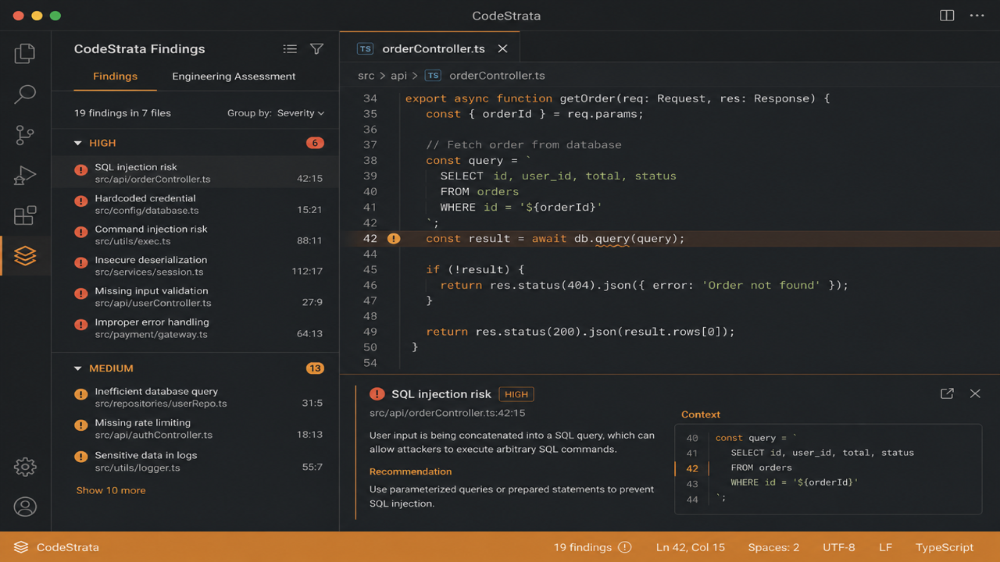
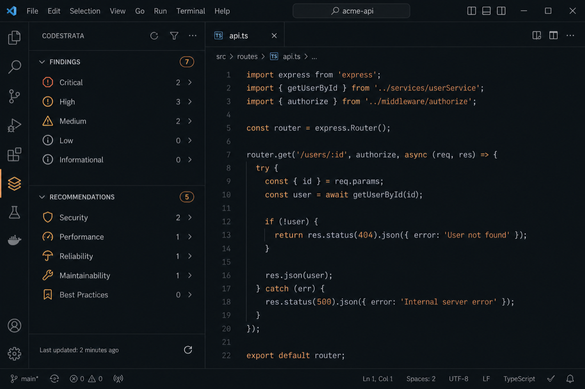
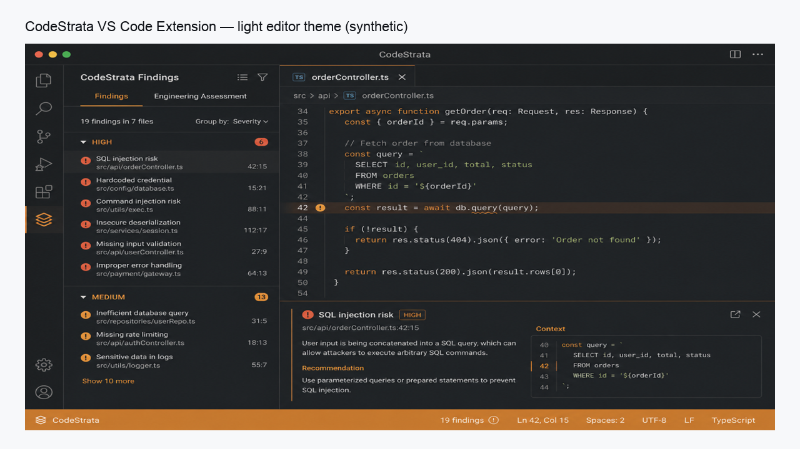
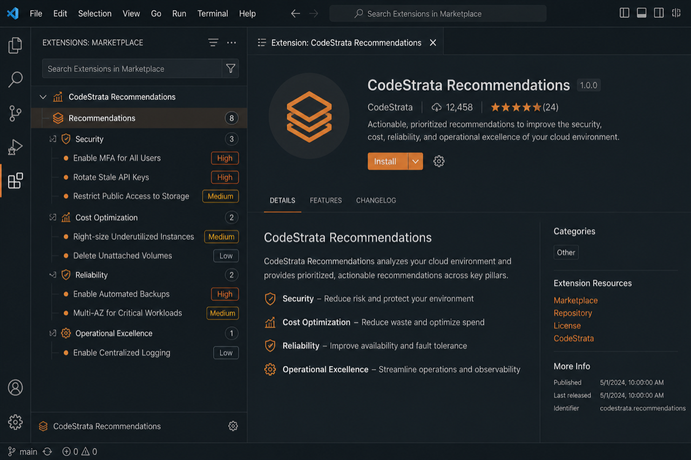
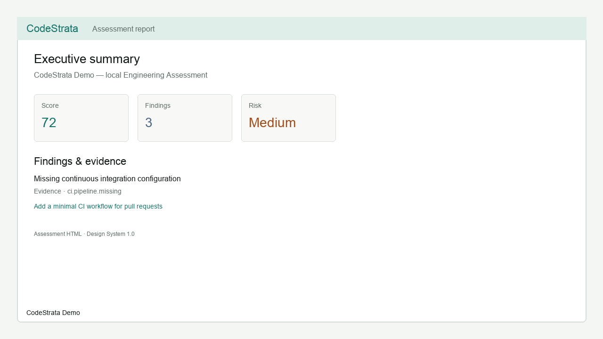
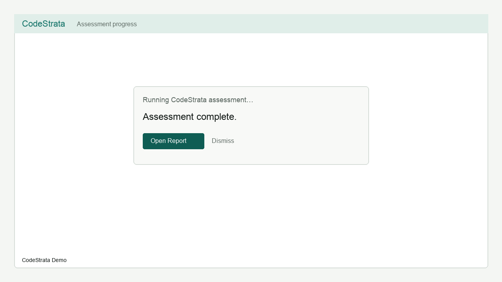

# CodeStrata VS Code Extension (Community Edition)

**Engineering Intelligence for Modern Software Organizations** — run local
**Engineering Assessments** with **CodeStrata Engine** without leaving VS Code.

**Identifier:** `codestrata.codestrata-vscode` · **Version:** 0.2.0  
**Requires:** CodeStrata Engine `>=0.1.0 <2.0.0` · Report schema **1.2**

```text
VS Code Extension
        ↓
CodeStrata Engine CLI
        ↓
Public JSON summary + report artifacts
        ↓
Findings · Recommendations · Diagnostics · HTML report
```

This extension is a **thin client**. It does not duplicate Engineering Intelligence,
import Engine Python modules, or use CodeStrata Platform APIs.

**Docs:** [https://docs.codestrata.ai/extensions/vscode](https://docs.codestrata.ai/extensions/vscode)  
**Support:** [SUPPORT.md](SUPPORT.md) · **Privacy:** [PRIVACY.md](PRIVACY.md) · **Security:** [SECURITY.md](SECURITY.md)



### Marketplace screenshots

| | |
| --- | --- |
| Activity |  |
| Findings |  |
| Findings (light) |  |
| Recommendations |  |
| HTML report |  |
| Progress |  |

## Who it is for

Developers and teams assessing **one repository at a time** locally with
**Community Edition** Engine. Not a replacement for CodeStrata Platform
organizational intelligence.

## Install

1. Install **CodeStrata VS Code Extension** from the Visual Studio Marketplace
   (or Open VSX / `Install from VSIX…`).
2. Open a repository folder (Workspace Trust respected).
3. On first run, the extension detects **CodeStrata Engine** or offers **Install Engine**.
4. Run **CodeStrata: Run Engineering Assessment** (first command).

Guided install uses `uv tool`, `pipx`, or
`python -m pip install --user 'codestrata[mcp]'`.

## First command

```text
CodeStrata: Run Engineering Assessment
```

Deterministic mode (`--no-ai`) is the default. Optional AI uses **Engine** provider
configuration only — never extension settings, never Platform API keys.

## Manual Engine install

```bash
python3.12 -m pip install --user 'codestrata[mcp]'
codestrata version
```

Or set `codestrata.engine.executable` to an absolute path.

## Commands

| Command | Purpose |
| ------- | ------- |
| Run Engineering Assessment | Deterministic assess (default) |
| Run Engineering Assessment with AI | Optional Engine AI |
| Install CodeStrata Engine | Guided install |
| Show Welcome / First Run | Replay onboarding |
| Check CodeStrata Environment | Resolve Engine + doctor |
| Initialize CodeStrata Configuration | `codestrata init` |
| Open Engineering Assessment Report | Latest `report.html` |
| Refresh Findings / Recommendations | Reload artifacts |
| Clear CodeStrata Results | Clear trees + diagnostics |
| Open CodeStrata Output | Output channel |
| Open Documentation | docs.codestrata.ai |

## Settings

| Setting | Purpose |
| ------- | ------- |
| `codestrata.engine.executable` | Explicit CLI path |
| `codestrata.assessment.outputDirectory` | `--output` |
| `codestrata.assessment.configPath` | Optional `codestrata.toml` |
| `codestrata.assessment.defaultNoAi` | Deterministic default |
| `codestrata.assessment.extraArgs` | Advanced passthrough (protected flags stripped) |
| `codestrata.findings.groupBy` | Tree grouping |
| `codestrata.ai.providerHint` | Messaging only |

**Discovery order:** configured → workspace `.venv` → active Python → `PATH`.

## Compatibility

| Contract | Support |
| -------- | ------- |
| VS Code | `^1.85.0` |
| CodeStrata Engine | `>=0.1.0 <2.0.0` |
| Report schema | `1.2` (major `1.x`) |
| Edition | Community Edition |

## Privacy & security

See [PRIVACY.md](PRIVACY.md) and [SECURITY.md](SECURITY.md). No Platform connection;
no default telemetry; Workspace Trust respected. Assessment artifacts stay local
unless you publish them yourself.

## Community vs Platform

| Community (this extension) | Platform (separate product) |
| -------------------------- | --------------------------- |
| Local Engine assess + reports | Org multi-repo intelligence |
| Optional Engine AI providers | Platform APIs / portfolio / RAG |
| Works offline with Engine | Requires Platform deployment |

## Troubleshooting

| Symptom | Action |
| ------- | ------ |
| Engine missing | **Install CodeStrata Engine** or **Check Environment** |
| Assessment fails | Open **CodeStrata Output**; run `codestrata doctor` |
| Stale findings | **Refresh Findings** after a new assess |
| AI errors | Configure providers in Engine `codestrata.toml` / env — not here |

More: [https://docs.codestrata.ai/troubleshooting/](https://docs.codestrata.ai/troubleshooting/)

## FAQ

**Q: Where do AI keys go?**  
Only in Engine configuration — never extension settings, never Platform keys.

**Q: Does this need CodeStrata Platform?**  
No. Platform is optional and separate.

## License

MIT — see [LICENSE](LICENSE).
